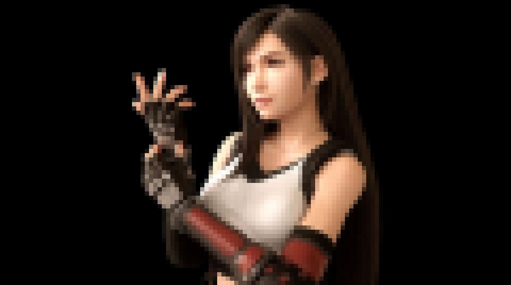

# Produce a ~~Photo~~mosaic from an image

## This is a work in progress. So far I have implemented image pixelating.

## Repurposing this to produce something far cooler than a photo mosaic ;)

5x5

10x10

20x20

